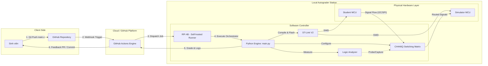
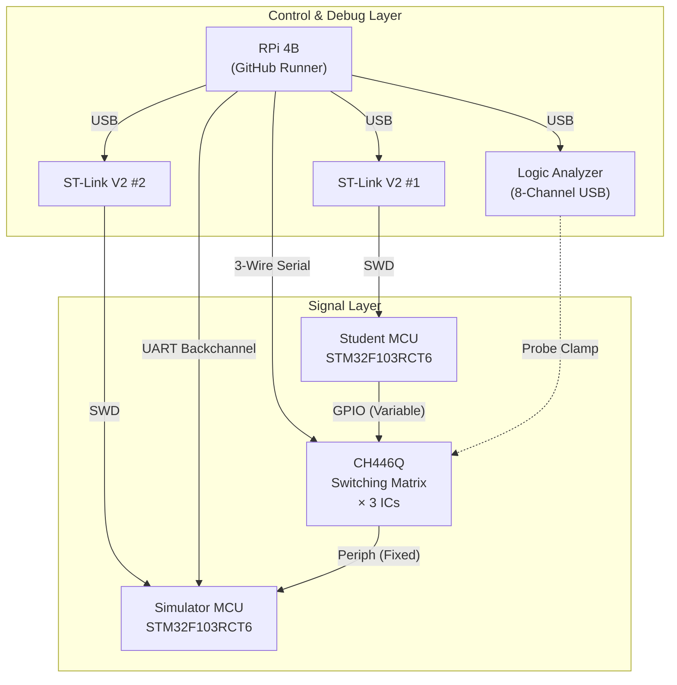
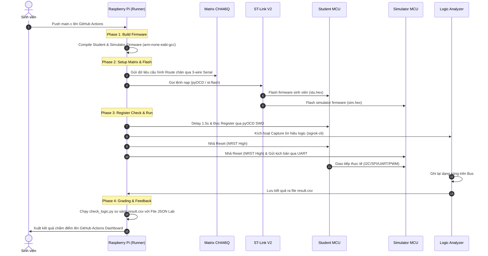

# VE-Lab Hardware Autograder System Design Document

Tài liệu thiết kế chi tiết hệ thống chấm điểm tự động Embedded Hardware sử dụng MCU STM32. Hệ thống thực hiện quy trình khép kín từ khâu biên dịch, nạp mã nguồn, cho đến capture tín hiệu thực tế và chấm điểm logic dựa trên dữ liệu thực tế từ thiết bị ngoại vi.

---

## 1. System Architecture (Kiến trúc hệ thống)

Hệ thống được thiết kế theo mô hình điều khiển tập trung, sử dụng một Central Controller để quản lý việc nạp chương trình, định cấu hình phần cứng chuyển mạch tín hiệu (Switching Fabric), giả lập môi trường ngoại vi và thu thập dữ liệu kiểm thử.

### 1.1. Sơ đồ kiến trúc tổng thể (Overall System Flow Diagram)



### 1.2. Sơ đồ khối kết nối phần cứng (Hardware Interconnection Block Diagram)



---

## 2. Hardware Architecture (Phần cứng sử dụng)

### 2.1. Danh sách thiết bị & Thông số kỹ thuật
*   **Central Controller (Raspberry Pi 4 Model B):**
    *   Nhiệm vụ: Chạy Self-hosted GitHub Actions Runner, điều phối toàn bộ quy trình chấm điểm.
    *   OS: Linux (Debian-based).
*   **Target MCUs:**
    *   **Student MCU (STM32F103RCT6 Black Pill):** Nạp và thực thi Firmware do sinh viên lập trình.
    *   **Simulator MCU (STM32F103RCT6 Black Pill):** Chạy Simulator Firmware để giả lập các linh kiện ngoại vi/sensor (như DS1307, DHT11, v.v.).
*   **Switching Fabric (3x CH446Q Analog Matrix ICs):**
    *   Cho phép Map chân tín hiệu linh hoạt giữa Student MCU và Simulator MCU mà không cần thay đổi dây cắm vật lý.
*   **Logic Analyzer (8-Channel USB Logic Analyzer):**
    *   Bắt và ghi lại dạng sóng (waveform) của các Bus tín hiệu (I2C, SPI, UART, PWM).
*   **Debuggers (2x ST-Link V2):**
    *   Nạp Firmware độc lập cho Student MCU và Simulator MCU qua giao thức SWD.

### 2.2. Chi tiết đấu nối & Interface

| Loại kết nối | Nguồn (Source) | Đích (Destination) | Mô tả giao tiếp |
| :--- | :--- | :--- | :--- |
| **Matrix Control** | RPi GPIO | 3x CH446Q | Giao tiếp 3-wire Serial (Shared CLK, Shared STB, 3x Independent DATA). |
| **UART Backchannel** | RPi UART | Simulator MCU | Link UART Full-duplex để truyền kịch bản test và đồng bộ hóa trạng thái. |
| **Signal Matrix (Flex)** | Student MCU | Matrix Side A | Các chân GPIO thay đổi tùy thuộc vào cấu hình bài nộp của sinh viên. |
| **Signal Matrix (Fixed)** | Matrix Side B | Simulator MCU | Các chân ngoại vi cố định của Simulator (I2C, SPI, UART, PWM). |
| **Logic Probes** | Logic Analyzer | Fixed Path | Kẹp trực tiếp vào đường truyền tín hiệu giữa Matrix và Simulator MCU. |
| **USB Host** | RPi 4B | Debuggers & LA | Kết nối dữ liệu và cấp nguồn cho 2 ST-Link V2 và Logic Analyzer. |

---

## 3. Software Architecture (Phần mềm sử dụng)

### 3.1. Host Toolchain & System Utilities
Các công cụ hệ thống được cài đặt trên Raspberry Pi dùng để tương tác với phần cứng:
*   **arm-none-eabi-gcc:** Compiler để dịch mã nguồn C của Student và Simulator thành file nhị phân.
*   **st-flash / pyOCD:** Thực hiện nạp chương trình (Flash) xuống MCU qua SWD. Ngoài ra, `pyOCD` được dùng để đọc các thanh ghi (Register) cấu hình trên Student MCU nhằm đánh giá việc cấu hình phần cứng.
*   **sigrok-cli:** Điều khiển Logic Analyzer thực hiện Capture tín hiệu logic trên Bus và xuất ra file dữ liệu `result.csv`.
*   **libgpiod (v2):** Điều khiển các chân GPIO của Raspberry Pi kết nối trực tiếp tới chân NRST (Reset) của các MCU.

### 3.2. Autograder Software Stack (Python Engine)
Toàn bộ logic chấm điểm và điều phối nằm trong thư mục [scripts/](../logic/scripts/):
*   **[main.py](../logic/scripts/main.py):** Bộ điều phối chính (Orchestrator). Quản lý toàn bộ vòng đời của một lượt chấm bài.
*   **[builder.py](../logic/scripts/builder.py):** Quản lý Compile. Tự động liên kết mã nguồn sinh viên với các template tương ứng và biên dịch ra file binary.
*   **[sigrok.py](../logic/scripts/sigrok.py):** Giao tiếp và điều khiển `sigrok-cli` để Capture tín hiệu với Sample Rate và số lượng mẫu cấu hình động.
*   **[check_reg.py](../logic/scripts/check_reg.py):** Kết nối SWD qua `pyOCD` để trực tiếp kiểm tra giá trị các Register ngoại vi của Student MCU.
*   **[check_logic.py](../logic/scripts/check_logic.py):** Parse dữ liệu tín hiệu từ `result.csv` và kiểm tra tính đúng đắn dựa trên các Test Case đã định nghĩa trong file cấu hình bài tập JSON.

### 3.3. Dynamic Simulator Firmware Configuration
Simulator được thiết kế linh hoạt thay vì sử dụng Firmware tĩnh:
*   Mã nguồn sử dụng Preprocessor Flags trong `app_config.h` để bật/tắt các module giả lập tương ứng.
*   [builder.py](../logic/scripts/builder.py) điều khiển quá trình Build thông qua việc truyền biến `EXTRA_DEFS` vào `Makefile`:
    ```bash
    make EXTRA_DEFS="-DENABLE_DS1307=1"
    ```

---

## 4. Flow Sequence (Quy trình vận hành)

Quy trình tự động hóa toàn bộ được thực hiện qua các Phase tuần tự sau:

### 4.1. Sơ đồ tuần tự thực thi (Sequence Diagram)


### 4.2. Chi tiết các bước vận hành
1.  **TRIGGER:** Sinh viên push bài làm (`main.c`) lên GitHub, kích hoạt GitHub Actions tự động chạy trên Self-hosted Runner (Raspberry Pi 4B).
2.  **BUILD:** Runner tự động gọi [builder.py](../logic/scripts/builder.py) để dịch file bài làm của sinh viên thành `stu.hex` và Simulator Firmware tương ứng thành `sim.hex`.
3.  **MATRIX SETUP:** Runner cấu hình IC chuyển mạch CH446Q để map các chân của Student MCU (ví dụ chân I2C SDA/SCL) nối thông vật lý tới các chân định sẵn trên Simulator MCU.
4.  **FLASH:** Sử dụng ST-Link nạp đồng thời code sinh viên và code giả lập xuống hai MCU riêng biệt.
5.  **INIT CHECK:** Sử dụng SWD thông qua [check_reg.py](../logic/scripts/check_reg.py) để kiểm tra xem sinh viên đã khởi tạo đúng các Register của ngoại vi cần thiết hay chưa.
6.  **SIMULATION & CAPTURE:** Nhả Reset cho cả hai MCU hoạt động đồng thời. Simulator MCU nhận lệnh từ UART để tương tác với Student MCU. Logic Analyzer thực hiện Capture toàn bộ khung truyền tín hiệu trên Bus vật lý và lưu thành `result.csv`.
7.  **GRADING:** [check_logic.py](../logic/scripts/check_logic.py) tiến hành chấm điểm bằng cách phân tích tập tin CSV để kiểm tra Timing, Frame dữ liệu truyền nhận, và định dạng giao thức so với cấu hình chuẩn trong file JSON của bài tập đó.
8.  **FEEDBACK:** Điểm số và logs chi tiết được tổng hợp trả về giao diện GitHub Actions để phản hồi trực quan cho sinh viên.
