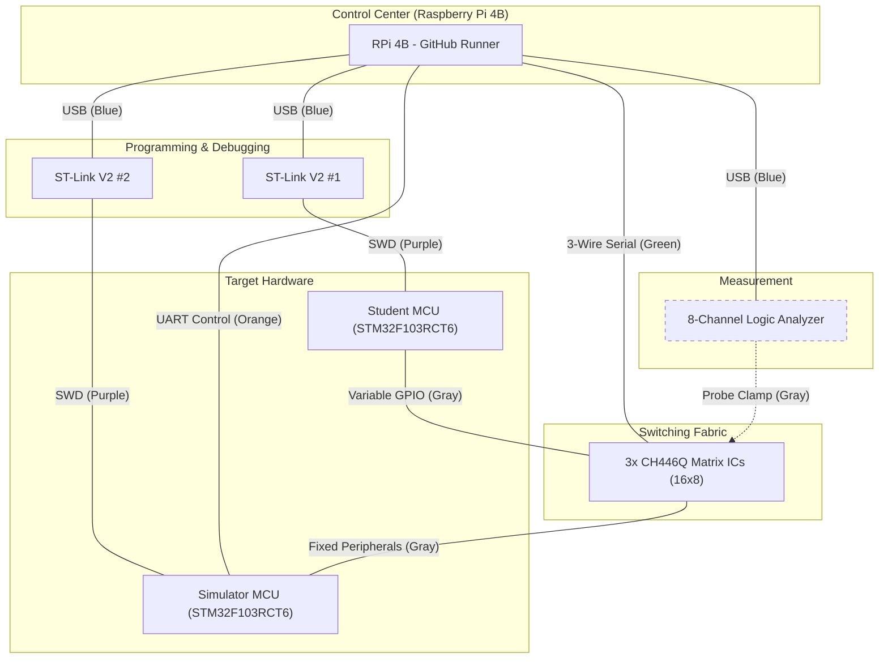

# VE-Lab Hardware Autograder Architecture

## 1. Sơ đồ khối hệ thống

---

## 2. Thông số kỹ thuật Hardware

### 2.1. Central Controller
- **Model**: Raspberry Pi 4 Model B.
- **Service**: Chạy Self-hosted GitHub Actions Runner.
- **OS**: Linux (Debian-based).

### 2.2. Microcontrollers (MCUs)
- **Student MCU**: STM32F103RCT6 (Black Pill). Thực thi Firmware do sinh viên nộp.
- **Simulator MCU**: STM32F103RCT6 (Black Pill). Giả lập các ngoại vi, sensors.

### 2.3. Interconnects & Tools
- **Switching Fabric**: 3x CH446Q Analog Crosspoint Matrix ICs. Cho phép Map chân linh hoạt giữa Student MCU và Simulator MCU.
- **Logic Analyzer**: Thiết bị USB 8 kênh dùng để Capture dữ liệu trên Bus.
- **Debuggers**: 2x ST-Link V2 để nạp Firmware độc lập cho từng MCU.

---

## 3. Chi tiết đấu nối & Interface

| Loại kết nối | Nguồn | Đích | Mô tả |
|:--- |:--- |:--- |:--- |
| **Matrix Control** | RPi GPIO | 3x CH446Q | 3-wire Serial interface (Shared CLK, Shared STB, 3x Independent DATA). |
| **UART Backchannel** | RPi UART | Sim MCU | Link UART Full-duplex để điều khiển và Inject kịch bản mô phỏng. |
| **Signal Matrix (Flex)** | Stu MCU | Matrix Side A | Kết nối với các chân GPIO thay đổi tùy theo bài làm của sinh viên. |
| **Signal Matrix (Fixed)**| Matrix Side B | Sim MCU | Kết nối với các chân ngoại vi cố định của Simulator (I2C, SPI, UART, PWM). |
| **Logic Probes** | Logic Analyzer| Fixed Path | Kẹp (clamp) trực tiếp vào đường tín hiệu giữa Matrix và Sim MCU để giám sát Bus. |
| **USB Host** | RPi 4B | Tools | Cổng Host cho cả 2 ST-Link và Logic Analyzer. |

---

## 4. Quy trình vận hành (Phases)

1.  **TRIGGER**: Sinh viên push `main.c` lên GitHub. Pi 4B Runner nhận diện Job.
2.  **BUILD**: Pi compile Firmware sinh viên và Firmware Simulator bằng `arm-none-eabi-gcc`.
3.  **MATRIX SETUP**: Pi cấu hình Matrix CH446 thông qua 3-wire interface để Route các chân của Student MCU vào đúng Bus.
4.  **FLASH**: Các file HEX được nạp xuống cả 2 MCU thông qua ST-Link.
5.  **INIT CHECK**: Pi sử dụng `pyOCD` (SWD) để check init Register của Student MCU.
6.  **SIMULATION & CAPTURE**: Pi gửi kịch bản test đến Simulator qua UART, đồng thời Logic Analyzer ghi lại các tín hiệu trên Bus.
7.  **GRADING**: Python Engine so khớp dữ liệu từ `result.csv` với các Test Case định nghĩa trong file JSON của từng bài Lab.
8.  **FEEDBACK**: Điểm số và Log chi tiết được gửi ngược lại giao diện GitHub Actions.

---
