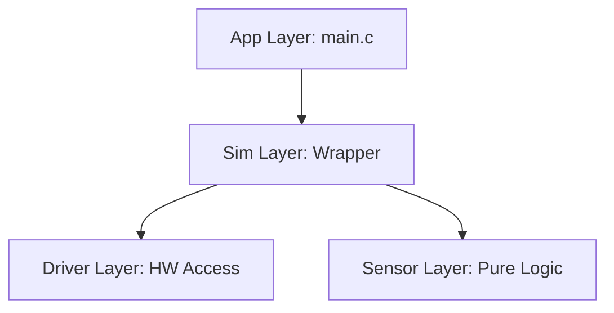

# Simulator Firmware Coding & Architecture Standard

Tài liệu này định nghĩa cấu trúc phân lớp, quy tắc đặt tên và chuẩn tài liệu cho dự án.

## 1. Kiến trúc phân lớp (Architecture)



| Layer | Prefix | Đặc tính chính |
| :--- | :--- | :--- |
| **App** | N/A | Điều phối khởi tạo hệ thống trong `main.c`. |
| **Sim** | `sim_` | Tự đóng gói (Self-contained), quản lý RTOS Task & IRQ. |
| **Sensor** | `prefix_` | Pure C logic, không phụ thuộc phần cứng/RTOS. |
| **Driver** | `prefix_` | Object-Oriented, điều khiển ngoại vi MCU. |

## 2. Quy tắc đặt tên (Naming Convention)

*   **Tên biến/hàm**: Tường minh. KHÔNG dùng biến 1-2 ký tự (như `it`, `temp`).
*   **Biến khởi tạo SPL cục bộ**: Đặt theo dạng `periph_init` (VD: `dac_init`, `uart_init`, `gpio_init`).
*   **Hàm Public**: `prefix_action_object` (VD: `uart_setup_baudrate`).
*   **Hàm Private**: `prv_action_object` (Khai báo `static`).
*   **Suffixes**:
    *   `_t`: Struct / Enum (VD: `uart_t`).
    *   `_evt_t`: Event Payload struct (VD: `uart_evt_t`).
    *   `_cb`: Callback type (VD: `uart_event_cb`).

## 3. Chuẩn Comment (Documentation)

Sử dụng **Technical English Terms** để đảm bảo tính ngắn gọn và chuyên nghiệp.

### A. File Header (.h) - Interface Description
Sử dụng định dạng Doxygen để IDE hiển thị gợi ý.
```c
/**
 * @brief  Setup GPIO pin mode and speed.
 * @param  dev     Pointer to GPIO object.
 * @return DRIVER_OK on success.
 */
driver_status_t gpio_setup(gpio_t *dev, ...);
```

### B. File Source (.c) - Implementation
Hạn chế comment giải thích logic hiển nhiên. Chỉ comment cái **"Tại sao" (The Why)**.
```c
/* Waiting for VREF stabilization per datasheet section 4.2 */
USART1->CR1 |= 0x2000; /* Enable UART peripheral */
```

## 4. Cấu trúc khởi tạo (Startup Sequence)

Hàm `main()` phải sạch sẽ (Clean Main), chỉ thực hiện:
1.  System Init (Clock, NVIC).
2.  Module Init: Gọi các hàm `sim_xxx_init()`.
3.  Start Scheduler: `vTaskStartScheduler()`.
